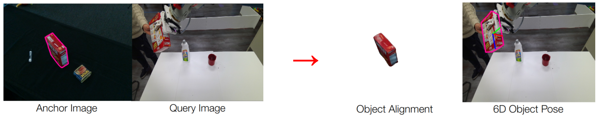

# Any6D: Model-free 6D Pose Estimation of Novel Objects

This is the official implementation of our paper accepted by CVPR 2025 

[[Website]](https://sites.google.com/view/taeyeop-lee/any6d) [[Paper]](https://arxiv.org/pdf/2503.18673)

Authors: Taeyeop Lee, Bowen Wen, Minjun Kang, Gyuree Kang, In So Kweon, Kuk-Jin Yoon

<p align="center">
  
</p>

# Abstract

We introduce Any6D, a model-free framework for 6D object pose estimation that requires only a single RGB-D anchor image to estimate both the 6D pose and size of unknown objects in novel scenes. Unlike existing methods that rely on textured 3D models or multiple viewpoints, Any6D leverages a joint object alignment process to enhance 2D-3D alignment and metric scale estimation for improved pose accuracy. Our approach integrates a render-and-compare strategy to generate and refine pose hypotheses, enabling robust performance in scenarios with occlusions, non-overlapping views, diverse lighting conditions, and large cross-environment variations. We evaluate our method on five challenging datasets: REAL275, Toyota-Light, HO3D, YCBINEOAT, and LM-O, demonstrating its effectiveness in significantly outperforming state-of-the-art methods for novel object pose estimation.


<p align="center">
  
</p>


# Installation
```
# create conda environment
conda create -n Any6D python=3.9

# activate conda environment
conda activate Any6D

# Install Eigen3 3.4.0 under conda environment
conda install conda-forge::eigen=3.4.0
export CMAKE_PREFIX_PATH="$CMAKE_PREFIX_PATH:/eigen/path/under/conda"

# install dependencies (cuda 12.1, torch 2.4.1)
python -m pip install -r requirements.txt

# Install NVDiffRast
python -m pip install --quiet --no-cache-dir git+https://github.com/NVlabs/nvdiffrast.git

# Kaolin
python -m pip install --no-cache-dir kaolin==0.16.0 -f https://nvidia-kaolin.s3.us-east-2.amazonaws.com/torch-2.4.0_cu121.html

# PyTorch3D
pip install --extra-index-url https://miropsota.github.io/torch_packages_builder pytorch3d==0.7.8+pt2.4.1cu121

# Build extensions
CMAKE_PREFIX_PATH=$CONDA_PREFIX/lib/python3.9/site-packages/pybind11/share/cmake/pybind11 bash foundationpose/build_all_conda.sh

# build SAM2
cd sam2 && pip install -e . && cd checkpoints && \
./download_ckpts.sh && \
cd ..

# build InstantMesh 
cd instantmesh && pip install -e . && cd ..
# build bop_toolkit
cd bop_toolkit && python setup.py install && cd .. 
```

### CheckPoints
Download the model checkpoints from the following 
- [foundationpose](https://drive.google.com/drive/folders/1DFezOAD0oD1BblsXVxqDsl8fj0qzB82i)
- [sam2](https://dl.fbaipublicfiles.com/segment_anything_2/092824/sam2.1_hiera_large.pt)
- [instantmesh](https://huggingface.co/TencentARC/InstantMesh/tree/main)

Create the directory structure as follows:
```
foundationpose/
└── weights/
    ├── 2024-01-11-20-02-45/
    └── 2023-10-28-18-33-37/

sam2/
└── checkpoints/
    ├── sam2.1_hiera_large.pt
    
instantmesh/
└── ckpts/
    ├── diffusion_pytorch_model.bin
    └── instant_mesh_large.ckpt
```

### Download dataset
- [YCBV Models](https://drive.google.com/file/d/1gmcDD-5bkJfcMKLZb3zGgH_HUFbulQWu/view?usp=sharing)
- [HO3D Evaluation Files (evaluation.zip, masks_XMem.zip)](https://drive.google.com/drive/folders/1Wk-HZDvUExyUrRn7us4WWEbHnnFHgOAX)
- [Any6D Anchor Results](https://huggingface.co/datasets/taeyeop/Any6D/resolve/main/dexycb_reference_view_ours.zip?download=true)

[//]: # (- [YCBInEOAT]&#40;https://archive.cs.rutgers.edu/archive/a/2020/pracsys/Bowen/iros2020/YCBInEOAT/&#41;)
[//]: # (- [REAL275]&#40;https://github.com/hughw19/NOCS_CVPR2019&#41;)
[//]: # (- [Toyota-Light &#40;TOYL&#41;]&#40;https://bop.felk.cvut.cz/datasets/&#41;)
 

# Run Demo
```
python run_demo.py
python run_demo.py --img_to_3d # running instantmesh + sam2
``` 
# Run on Public Datasets (HO3D)
### Dataset Format
```
ho3d/
├── evaluation/         # HO3D evaluation files (e.g., annotations)
├── masks_XMem/         # Segmentation masks generated by XMem
└── YCB_Video_Models/   # 3D models for YCB objects (used in HO3D)
```
### 1. Run Anchor Image
We provided our input, image-to-3d results and anchor results [huggingface](https://huggingface.co/datasets/taeyeop/Any6D/resolve/main/dexycb_reference_view_ours.zip). 
```
python run_ho3d_anchor.py \
  --anchor_folder /anchor_results/dexycb_reference_view_ours \    # Path to anchor results
  --ycb_model_path /dataset/ho3d/YCB_Video_Models                 # Path to YCB models
  # --img_to_3d                                                   # Running instantmesh + sam2
```

### 2.  Run Query Image
```
python run_ho3d_query.py \
  --anchor_path /anchor_results/dexycb_reference_view_ours \     # Path to anchor results
  --hot3d_data_root /dataset/ho3d \                              # Root path to HO3D dataset
  --ycb_model_path /dataset/ho3d/YCB_Video_Models                # Path to YCB models
```


# Acknowledgement
We would like to acknowledge the contributions of public projects [FoundationPose](https://github.com/NVlabs/FoundationPose), [InstantMesh](https://github.com/TencentARC/InstantMesh), [SAM2](https://github.com/facebookresearch/sam2), [Oryon](https://github.com/jcorsetti/oryon) and [bop_toolkit](https://github.com/thodan/bop_toolkit) for their code release. We also thank the CVPR reviewers and Area Chair for their appreciation of this work and their constructive feedback.

# Citations
```
@inproceedings{lee2025any6d,
    title     = {{Any6D}: Model-free 6D Pose Estimation of Novel Objects},
    author    = {Lee, Taeyeop and Wen, Bowen and Kang, Minjun and Kang, Gyuree and Kweon, In So and Yoon, Kuk-Jin},
    booktitle = {Proceedings of the Computer Vision and Pattern Recognition Conference (CVPR)},
    year      = {2025},
}
```


